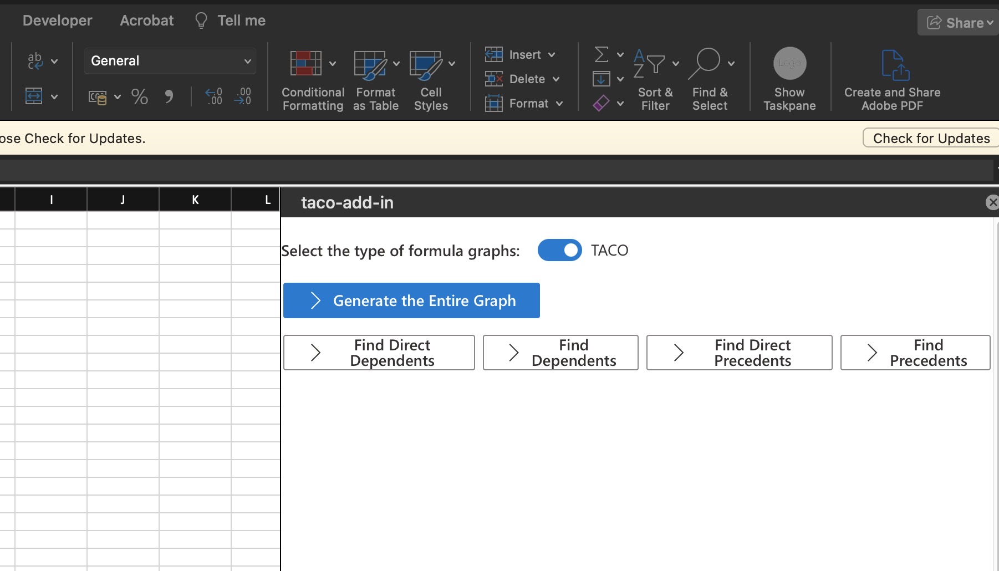

# **Getting Started**

## **Development Quick Start**

### **Starting the backend server:**

1. Open the project using Intellij IDEA
3. Start the server from `App.java`. In Intellij IDEA you can use the play button at the top right of the editor to launch the app from `App.java`.

### **Starting the Excel add-in server:**

1. Open a new terminal and navigate to the `add-in` folder.
   ```sh
   cd add-in
   ```

2. Install dependencies:
   ```sh
   npm i
   ```

3. Run the following command to start the add in.
   ```sh
   npm run start
   ```

4. A new Excel workbook should open automatically and you should be able to access the task plane for the add-in. 

5. You can also use the add-in in your own Excel workbook.

   
