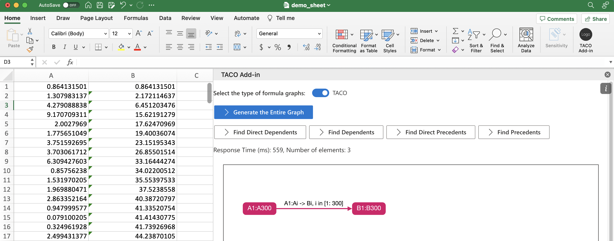

# **Overview**
TACO-Lens is an Excel plugin that is based on TACO, a framework that efficiently compresses, queries, and maintains spreadsheet formula graphs. In TACO-Lens, users can visually inpsect formula graphs in a compact representation provided by TACO and efficiently trace dependents or precedents given a selected spreadsheet range. 

TACO-Lens is published in VLDB'23 as a [demo paper](https://people.eecs.berkeley.edu/~totemtang/paper/TACO-Lens.pdf), TACO is published in [ICDE'23](https://people.eecs.berkeley.edu/~totemtang/paper/TACO-TR.pdf), and the TACO source code is [here](https://github.com/taco-org/taco).

# **Using TACO-Lens**

### Start the backend server using Docker:

1. Start the backend web server
   ```sh
   docker-decompose up
   ```

### **Start the Excel add-in:**

1. Open a new terminal and move to the `add-in` folder.
   ```sh
   cd add-in
   ```

2. Install dependencies:
   ```sh
   npm i
   ```

3. Run the following command to start the add-in.
   ```sh
   npm run start
   ```

4. A new Excel workbook should open automatically along with the add-in. Users can also use this add-in for their Excel workbooks by opening one Excel file (e.g., the **demo.xlsx** file we provided). To hide or open this add-in, users can click the **TACO Add-in** icon.

5. By clicking **Generate the Entire Graph**, the add-in will generate the formula graph for the current sheet using the representation of TACO. Users can zoom in/out and pan to explore different parts of the formula graph. 

6. Users can also inspect the (direct) dependents/precedents of a spreadsheet range. To do this, select the range on the worksheet and click the corresponding button in the add-in. Then, the corresponding dependents/precedents will be visualized in the add-in.


